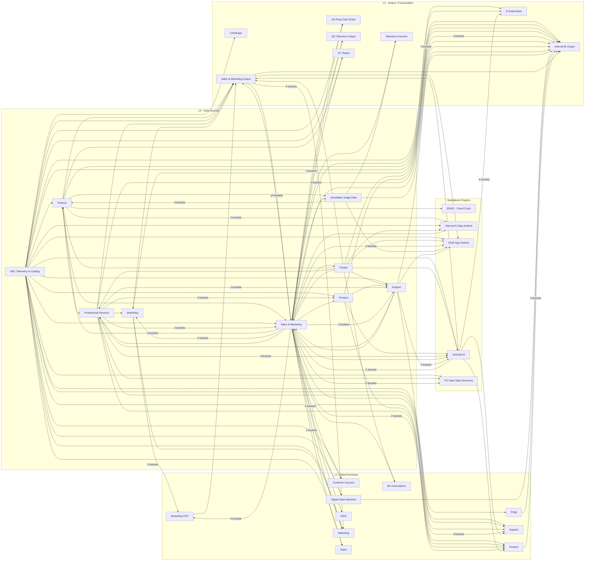

# Keboola Cross-Project Data Lineage

> Generated from `kbagent --json lineage` on 2026-02-26.
> 34 projects, 107 unique data links, 332 shared buckets.

## Architecture Overview

The projects follow a 3-layer architecture:

- **L0 (Data Sources)** -- Raw data extraction from external systems (Salesforce, Jira, Zendesk, BambooHR, etc.)
- **L1 (Data Processes)** -- Business logic transformations, enrichment, ML automations
- **L2 (Output / Consumption)** -- BI dashboards, data shares, marketing outputs
- **Standalone** -- Cross-cutting projects (AI, KIDS App Factory, Cloud Costs, PS Discovery)

## Mermaid Diagram

